

  

  
  
  
  

<h1 align="center">Chenxu Wang (wcx12)</h1>

<b>BIT Student · ML Researcher · Open Source Builder</b>

  <a href="https://wcx12.github.io/wcx12/"><b>Open My Interactive Website</b></a>

---

## About Me
- I am studying at **Beijing Institute of Technology** and plan to graduate in **2026**.
- I study reliable visual intelligence under imperfect observations and limited labels, with work spanning **Point-set Registration**, **Visual Place Recognition**, and **Medical Image Analysis**.
- I also build **evidence-grounded LLM systems** and exploratory **AI for Education** tools.
- I mainly build with **Python**, machine learning frameworks, and practical engineering workflows.
- I am currently applying for **Master's / PhD** opportunities.

## Selected Publications
- **TF-VPR: A novel benchmark for training-free visual place recognition.** Neurocomputing, 2026. [DOI](https://doi.org/10.1016/j.neucom.2026.133399)
- **Synergistic learning for active learning: A unified training objective for sample-efficient medical image classification.** Neurocomputing, in press, 2026. [DOI](https://doi.org/10.1016/j.neucom.2026.134314)

Full author lists and research mappings are available in the [publication index](https://wcx12.github.io/wcx12/publications/).

## Core Stack

  

## Metrics (Stable Local Render)

  

## Resources
- Research index: [research/](./research/)
- Publications: [publications/](./publications/) (generated from the canonical records in [site-data.js](./site-data.js))
- Research profile: [resume/](./resume/) and [zh/resume/](./zh/resume/) (generated from [resume.md](./resume.md) and [resume.zh.md](./resume.zh.md))
- Writing: [blog/](./blog/)
- Site maintenance and authoring: [CONTRIBUTING.md](./CONTRIBUTING.md)

  

