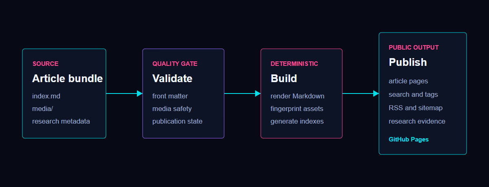

This writing space sits beside the interactive profile rather than replacing it. The homepage stays focused on research, projects, publications, and quick exploration. Longer technical notes live here with stable URLs, cleaner typography, and explicit links to their source material.



## Authoring model

Creating a post produces a self-contained article directory:

```powershell title="Create a new post"
npm run new:post "Visual Place Recognition Notes"
```

```text title="Article bundle"
content/posts/2026-07-11-visual-place-recognition-notes/
  index.md
  media/
    retrieval-results.webp
```

The Markdown front matter controls discovery, research mapping, math rendering, navigation, and publication state.

```yaml title="Post metadata"
title: "Visual Place Recognition Notes"
slug: "visual-place-recognition-notes"
date: "2026-07-11"
updated: "2026-07-11"
category: "Computer Vision"
tags: ["vpr", "retrieval", "benchmark"]
research: ["vpr"]
draft: false
math: true
toc: true
```

Local article images use portable `media/...` links. The build verifies that every referenced file exists with exact casing, stays inside its article directory, is not a symbolic link, matches an allowed raster signature, and remains below the publication size limit. Published images also require meaningful alternative text. Other downloadable artifacts stay in a repository or release instead of sharing the article origin.

## Publication states

The repository has three explicit states:

- `draft: true` keeps an article private regardless of its date.
- A non-draft article with a future date is scheduled.
- A non-draft article whose date has arrived in the site timezone is published.

The scheduled workflow rebuilds the site shortly after midnight in Asia/Shanghai. Because every public collection is generated from the same filtered post list, a draft or scheduled article cannot leak into search, tags, RSS, the sitemap, or research evidence.

## Generated evidence

The source of truth remains plain Markdown and versioned media in GitHub. The build produces:

- stable article and archive URLs;
- syntax-highlighted code and optional KaTeX mathematics;
- tag pages, search metadata, RSS, and sitemap entries;
- links from relevant research areas when a post has an explicit research mapping;
- content fingerprints that prevent browsers from mixing resources across deployments.

This first note is intentionally compact, but it exercises the same path intended for longer experiment logs, paper notes, tutorials, and engineering retrospectives.

## Inspect the implementation

The claims above can be checked against the public implementation:

- [homepage source repository](https://github.com/wcx12/wcx12);
- [this article's versioned Markdown source](https://github.com/wcx12/wcx12/blob/main/content/posts/2026-07-10-building-a-research-writing-system/index.md);
- [content validation and media policy](https://github.com/wcx12/wcx12/blob/main/scripts/blog-content.mjs);
- [deterministic site generator](https://github.com/wcx12/wcx12/blob/main/scripts/build-blog.mjs);
- [scheduled build workflow](https://github.com/wcx12/wcx12/blob/main/.github/workflows/blog-build.yml).

The [public research index](https://wcx12.github.io/wcx12/research/) remains separate from this engineering case study, so site infrastructure is not presented as research evidence.
