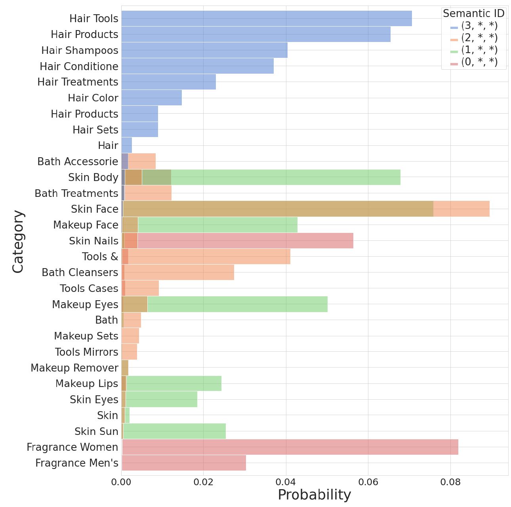
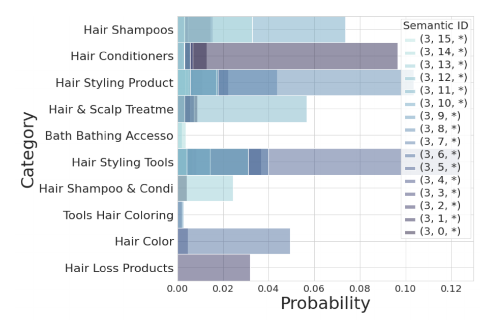
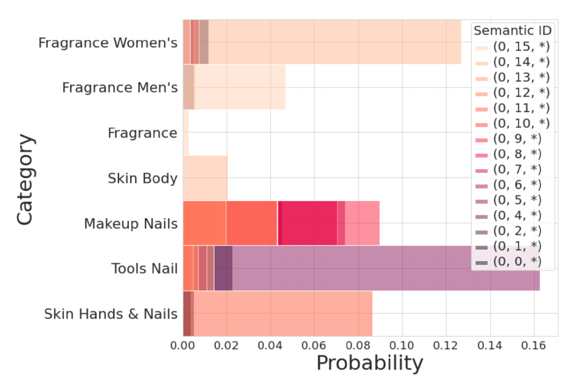
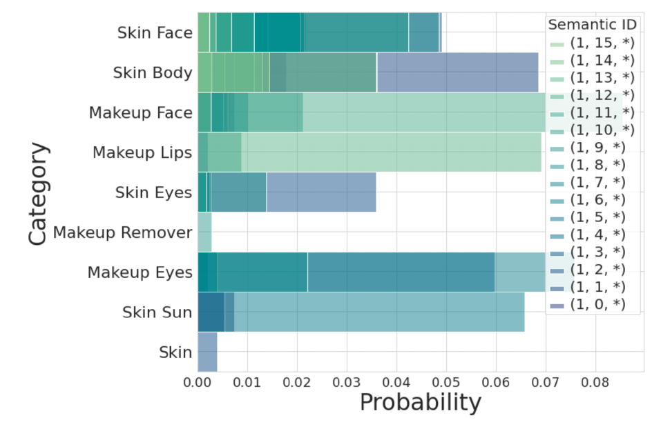
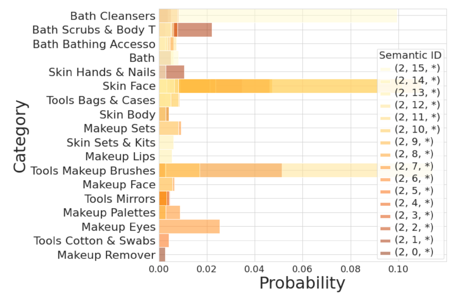

> **导语：** TIGER 最值得注意的地方，也许不是它使用 Transformer 生成物品，而是它先把物品 ID 变成了一种可学习、可共享的离散语言。

我过去理解的推荐检索，大体遵循同一种结构：模型先根据用户历史得到一个用户向量，再去物品向量库中寻找高分候选。如果用内积评分，这个目标就是 [MIPS](term:mips)；大规模检索时，可以用 [ANN](term:ann) 近似搜索来减少计算。前者描述“找什么”，后者描述“怎样近似地找”，并不是两种互斥的方法。

```text
用户历史
→ 用户/查询向量
→ 外部物品索引
→ 搜索高分物品（可采用 ANN 近似搜索）
→ Top-K 候选
```

模型可以从 RNN 换成 Transformer，也可以加入文本、图像或其他辅助信息，但“先表示用户，再搜索物品”的分工通常没有改变。模型负责理解用户，外部索引负责寻找物品。

[TIGER](https://proceedings.neurips.cc/paper_files/paper/2023/hash/20dcab0f14046a5c6b02b61da9f13229-Abstract-Conference.html) 提出了一个很直接的问题：既然 Transformer 可以生成一段序列，推荐系统能不能不再输出用于搜索的用户向量，而是直接生成下一个物品的 ID？

```text
用户历史
→ Transformer
→ 下一个物品的 ID
```

这听起来像是把检索替换成生成，但很快会遇到第一个障碍：普通 Item ID 没有任何语义。

编号 233 和 234 相邻，并不意味着对应的两个物品相似。如果每个物品仍然只是一个完全独立的类别，那么让 Transformer 预测 Item ID，本质上仍然接近一个超大规模分类问题。低频物品缺少训练信号，新物品也没有可以被模型直接生成的表示。

所以，TIGER 真正的第一步并不是更换检索器，而是重新设计物品 ID。

## 在生成物品之前，先把物品变成一种语言

TIGER 不再使用随机、原子的 Item ID，而是为每个物品构造由多个 token 组成的 **Semantic ID**。

```text
普通 Item ID：233
Semantic ID：(12, 24, 52)
```

如果两个物品在内容空间中比较相似，它们可能共享部分 token：

```text
物品 A：(12, 24, 52)
物品 B：(12, 24, 61)
```

这个变化看起来不大，实际改变了模型理解物品的方式。普通 Item ID 把每个物品视为互不相关的原子；Semantic ID 则允许不同物品共享一部分离散表示。模型在高频物品上学到的 token 表示，理论上也可以被相似的低频物品使用。

从这个角度看，Semantic ID 同时承担了三种作用：

- 把连续的物品内容表示压缩成离散 code；
- 让物品之间可以共享一部分 token；
- 把开放的物品集合翻译成 Transformer 可以生成的有限词表。

更完整的生成式推荐流程见[图 1](#fig-tiger-semantic-id-flow)：物品侧先把文本编码成 embedding，再通过 RQ-VAE 生成 Semantic ID；用户侧将交互历史转写成这些编号，让生成模型预测下一个物品的 ID，最后查表得到候选物品。这里的三元组只展示语义部分，后文会介绍用于区分碰撞物品的第四位编号。

::tiger-pipeline

## TIGER 的主要模型架构

这一部分只回答一个问题：TIGER 到底怎样把“推荐下一个物品”变成“生成下一个 Semantic ID”。它可以拆成两段：先在物品侧训练一个 Semantic ID tokenizer，再在用户侧训练一个 encoder-decoder Transformer 去生成这些 token。

### RQ-VAE 如何生成 Semantic ID

[图 1](#fig-tiger-semantic-id-flow)上方的物品侧分支对应这里的核心操作。TIGER 首先把物品的标题、价格、品牌、类别等内容特征组成文本，通过 Sentence-T5 得到 768 维内容 embedding。随后，RQ-VAE 的编码器将它压缩到 32 维潜在空间，再进行三层残差量化。

残差量化可以理解为一个逐层修正、[从粗到细](#语义层次-前面的编号真的对应粗类别吗)的过程。

这里首先指重构意义上的逐层修正，不是对每个样本都严格单调下降的结构保证，也不直接等于“大类 → 子类”的人工标签树。作者进一步认为，较浅层码本产生的编号倾向于反映粗粒度语义，后续层则刻画更细的差异；后面的[语义层次实验](#语义层次-前面的编号真的对应粗类别吗)会展示作者用来支持这一解释的证据。

第一层码本先选择一个最接近当前向量的码向量。通常它不能精确还原输入，于是计算两者的残差；第二层码本近似这个残差，第三层继续修正剩余部分。

TIGER 主实验采用 3 层残差码本，每层码本包含 256 个 codeword；因此 RQ-VAE 先为每个 item 生成三位 Semantic ID。

从训练阶段看，这不是一个独立的最近邻量化器，而是一个 autoencoder 闭环：内容 embedding $x$ 进入 DNN encoder 得到 32 维潜在向量 $z$；三层 residual quantizer 把 $z$ 量化为 $\hat z$；DNN decoder 再从 $\hat z$ 重构出 $\hat x$，并用重构损失和量化损失联合训练 encoder、decoder 与码本。[图 2](#fig-tiger-rqvae-training)展示了编码、残差量化和解码重构的训练路径。

::tiger-rqvae-training

记物品内容 embedding 为 $x$，编码器 $E(\cdot)$ 将它映射为潜在向量 $z=E(x)$。RQ-VAE 量化的是这个潜在向量。量化层统一从 0 开始编号：$d=0,1,2$ 分别对应第一、第二、第三层；$C_d$ 是该层码本，$c_d$ 是选中码向量的整数编号，$e_{c_d}^{(d)}$ 是这个编号对应的 32 维向量。$r_d$ 表示进入该层的残差，$m=3$ 表示量化层数，不包含后续的碰撞编号。

以图 2 的 $(7,1,4)$ 为例，三层分别选择编号 7、1、4。**编号组成 ID，向量相加用于重构**：解码器处理的是三个 32 维码向量之和，不是把三个整数作为输入。每层码本包含 256 个向量；不同层即使选中相同数字，也是在各自码本中查找，不代表同一个向量。

如果多个物品得到相同的三元组，后面的[碰撞处理](#碰撞发生后怎么办)会追加第四位编号。它用来恢复物品唯一性，不属于残差量化层，也不参与 RQ-VAE 的重构或量化损失。

在第 $d$ 层，量化器做的最近邻选择可以写成：

$$
c_d=\arg\min_k \lVert r_d-e_k^{(d)}\rVert_2^2.
$$

下文将第 $d$ 层选中的码向量 $e_{c_d}^{(d)}$ 简记为 $e_{c_d}$。

设初始潜在向量为 $z$：

$$
r_0=z,\qquad r_{d+1}=r_d-e_{c_d}.
$$

经过 $m$ 层后：

$$
r_m=z-\sum_{d=0}^{m-1}e_{c_d}.
$$

因此，量化表示自然写成：

$$
\hat z=\sum_{d=0}^{m-1}e_{c_d}.
$$

各层 codeword 的编号组成物品的 Semantic ID：

```text
内容 embedding
→ RQ-VAE encoder
→ 第一层量化整体向量
→ 第二层量化第一层残差
→ 第三层量化第二层残差
→ Semantic ID (c_0,c_1,c_2)
```

各层码向量最后相加，并不是额外设计出来的技巧。量化时逐层做减法，重构时自然需要把各层近似结果加回来。最终残差 $r_m=z-\hat z$ 越小，量化表示就越接近原始潜在向量。

### RQ-VAE 的损失函数

从训练目标看，RQ-VAE 仍然先是一个 autoencoder。编码器把内容 embedding $x$ 压成 $z$，残差量化得到 $\hat z$，解码器再从 $\hat z$ 重构出 $\hat x$。因此最基本的信号是重构损失：

$$
L_{\text{recon}}=\lVert x-\hat x\rVert^2.
$$

重构损失要求离散表示保留足够多的物品内容，让 decoder 能还原输入 embedding，这是自编码器的基本训练目标。不过，最近邻选码是离散操作：编号不会随输入平滑变化，重构梯度不能直接穿过选码操作按普通连续函数求导。

VQ-VAE 使用**直通估计**解决这一训练问题：前向仍使用选中的码向量，反向则把解码器输入端的重构梯度传回编码器输出。[图 2](#fig-tiger-rqvae-training)下方的反向路径展示了这一近似：重构误差可以继续训练编码器，但这不表示对离散编号求出了真实导数。

这是 [VQ-VAE 第 3.2 节](https://arxiv.org/html/1711.00937v2#S3.SS2)的训练原理；TIGER 沿用离散量化框架，但没有完整展开多层计算图的实现。直通估计与 stop-gradient 不同：前者给量化操作指定近似的反向路径，后者截断某条路径，具体分工见下面的补充。

VQ-VAE 还给出了变分解释：在确定性的量化后验和均匀先验下，KL 项为常量，不参与参数优化。TIGER 实际优化的是重构项与量化项之和：

$$
L(x)=L_{\text{recon}}+L_{\text{rqvae}},\qquad
L_{\text{rqvae}}=\sum_{d=0}^{m-1}L_d.
$$

这里 $L_{\text{recon}}$ 负责“能不能重构 item 内容”，$L_{\text{rqvae}}$ 负责“残差和离散码本能不能对齐”。

具体到第 $d$ 层，论文使用的量化损失是：

$$
L_d=
\lVert \operatorname{sg}[r_d]-e_{c_d}\rVert^2
+\beta\lVert r_d-\operatorname{sg}[e_{c_d}]\rVert^2.
$$

其中，$L_d$ 是第 $d$ 层的量化损失，$r_d$ 是该层 residual，$e_{c_d}$ 是该层被选中的 codeword，$\beta$ 是 commitment 项权重；$\operatorname{sg}$ 表示 stop-gradient：前向计算时保留原值，反向传播时梯度为零。

两项都度量 residual 与所选 codeword 的距离，但梯度方向不同：第一项把 residual 当作目标来更新码字，第二项把码字当作目标来约束 residual。stop-gradient 决定每一项中哪一侧接收梯度，$\beta$ 则控制第二项的强度。

::disclosure[补充：为什么这个损失函数要拆成两项？]
先固定当前的选码结果，把本层 residual $r_d$ 与所选码向量 $e_{c_d}$ 视为两个输入，观察每一项对它们的偏导。第一项是：

$$
L_{code}=\lVert \operatorname{sg}[r_d]-e_{c_d}\rVert^2,
$$

$\operatorname{sg}[r_d]$ 将当前 residual 视为常量。这一项的梯度只流向本层所选码向量 $e_{c_d}$：

$$
\frac{\partial L_{code}}{\partial e_{c_d}}
=2(e_{c_d}-r_d),
\qquad
\frac{\partial L_{code}}{\partial r_d}=0.
$$

所以这一项的作用是训练码本：哪个 codeword 被选中了，就把哪个 codeword 拉向当前 residual，让码本逐渐贴近数据分布。

再看第二项：

$$
L_{commit}=\beta\lVert r_d-\operatorname{sg}[e_{c_d}]\rVert^2,
$$

$\operatorname{sg}[e_{c_d}]$ 将本层所选码向量视为常量。这一项不沿该码向量分支传播梯度，而是把梯度传给 $r_d$：

$$
\frac{\partial L_{commit}}{\partial r_d}
=2\beta(r_d-e_{c_d}),
\qquad
\frac{\partial L_{commit}}{\partial e_{c_d}}=0.
$$

这就是 commitment：要求送入量化器的表示靠近所选码字，减少编码表示与离散表示之间的偏差。梯度沿 $r_d$ 的计算路径回传，从而约束产生该表示的编码器；$\beta$ 控制这种约束的强度。

多层残差量化还需要区分本层偏导与整个计算图的梯度。由于 $r_d=z-\sum_{j<d}e_{c_j}$，如果前面各层的码向量没有被截断梯度，commitment 还可能沿残差路径影响它们；若这些码向量被 detach，梯度则沿剩余路径回到编码器。直通估计（straight-through estimator）也会改变量化节点的反向路径。例如，[图像 RQ-VAE 的公开实现](https://github.com/kakaobrain/rq-vae-transformer/blob/main/rqvae/models/rqvae/quantizations.py#L248-L268)在 commitment 中对量化表示使用 detach，并单独构造直通路径。TIGER 原文给出了损失形式，但没有展开这些反向传播的实现细节。

因此，拆分损失的作用是分别控制“码字靠近 residual”和“residual 靠近码字”两种更新。上面的偏导描述本层两个输入的梯度方向；最终哪些参数收到梯度，还要沿完整的计算图判断。
::

因此，完整 RQ-VAE 训练包含三类信号：重构损失保留输入内容，码本项让码向量贴近 residual，commitment 项约束送入量化器的表示。它们共同学习编码器、解码器和码本；这个阶段尚未使用用户的下一物品预测目标。能重构内容，不等于已经学会推荐。

::disclosure[补充：为什么使用 K-means 初始化码本？]
如果码本随机初始化，一些 code vector 可能远离任何训练样本。最近邻选择是离散操作：一个 code 如果从未成为任何样本的最近邻，就收不到有效更新，最后成为 dead code。大量样本集中选择少数 code，就会形成 codebook collapse。

论文在第一个训练 batch 上做 K-means，并用聚类中心初始化码本。这能让初始 code 落在数据密集区域，提高它们在训练早期被选中的机会。

这项设计是合理的，但它只能降低 collapse 风险，并不能保证后续训练不再发生坍缩。实际复现时仍然需要持续观察每层 code usage、选择频率分布、perplexity 和 dead code 数量，而不能只在训练结束时检查一次利用率。

关于这个问题，我后来又做了一组更完整的实验。结果比“使用 K-means 就能避免坍缩”复杂得多：提高利用率不一定提高推荐指标，真正的问题还包括 hard assignment、条件路径和下游预测任务是否对齐。完整实验见：[TIGER 的语义 ID 为什么会坍缩](../tiger-semantic-id-codebook-capacity/)。
::

::disclosure[补充：不同的离散 ID 是怎样构造的？]
RQ-VAE 并不是构造离散 ID 的唯一办法。[图 3](#fig-tiger-quantizer-atlas)对比六种思路：它们如何利用内容、如何划分向量空间，以及多个编号之间是什么关系。

::tiger-quantizers

**PQ 与 RQ 的区别不在于“能不能生成”。** PQ 将向量分成多个子空间，分别量化，得到一组子空间编号；RQ 则保持向量维度不变，逐层量化剩余残差。两种编号序列都可以交给生成模型，区别是它们携带了不同的结构，不能仅凭结构判断谁的推荐效果更好。

**VQ-VAE 也能输出多个 token。** [VQ-VAE 原论文](https://arxiv.org/html/1711.00937v2#S3.SS2)对多个潜在位置分别量化；RQ-VAE 则对同一位置的向量继续量化残差。图中 VQ-VAE 部分只展开了一个位置。TIGER 在[第 3.1 节](https://proceedings.neurips.cc/paper_files/paper/2023/file/20dcab0f14046a5c6b02b61da9f13229-Paper-Conference.pdf#page=5)提到，尝试 VQ-VAE 得到的候选生成效果与 RQ-VAE 接近，但没有提供具体分数。Random ID、LSH 与 RQ-VAE 的定量对照见后文的[表示实验](#表示实验-为什么不是随机-id-或-lsh)。
::

### 碰撞发生后怎么办

不同物品可能得到相同的三元 Semantic ID。RQ-VAE 训练结束后，论文会检测这些碰撞，并在碰撞组内部追加一个局部编号：

```text
(12,24,52) → (12,24,52,0)
(12,24,52) → (12,24,52,1)
```

即使没有碰撞，也使用 0 补齐第四位，让所有 ID 长度一致。

第四个 token 不属于残差量化过程，也不一定带有内容语义。它只是同一碰撞组内部的唯一标识，不参与前面的 RQ-VAE 训练；到了后续的生成式推荐训练阶段，它会出现在历史与目标 ID 中，相关生成器参数才通过下一 token 预测任务学习。前三位提供量化表示，第四位恢复唯一性。

**完整 ID 与生成器词表有什么关系？** $(12,24,52,0)$ 是一个物品的完整地址，不是词表里的一个条目。生成器逐位使用 token；可以把这四个 token 示意为：

$$
t_{12}^{(0)},\quad t_{24}^{(1)},\quad t_{52}^{(2)},\quad t_{0}^{(3)}.
$$

上标表示 ID 的位置，最后一位对应碰撞编号。因此“第一位的 12”与“第二位的 12”不是同一个位置码 token。[原文第 6 页](https://proceedings.neurips.cc/paper_files/paper/2023/file/20dcab0f14046a5c6b02b61da9f13229-Paper-Conference.pdf#page=6)为四个位置共设置 $4\times256=1024$ 个物品 token，除此之外还有用户 token；这里的上标只是帮助区分位置，不指定代码中的编号偏移实现。

**生成器还会重新学习自己的 token embedding。** RQ-VAE 的码本保存 32 维码向量，用于量化和内容重构；生成器把离散 token 映射成 128 维输入表示，用于根据用户历史预测下一个物品。两套向量属于不同模型，训练目标也不同。共享某个位置的 token，意味着在生成器里共享对应的输入表示，并不意味着直接复用 RQ-VAE 的码向量。

::disclosure[讨论：理论容量为什么不等于有效容量？]

论文每层使用 256 个 codeword，RQ-VAE 共三层，并报告较高的 codebook usage（≥80%），但没有展开逐层利用率统计。码本利用率与多层 ID 组合的覆盖率不是同一个概念。

以单层利用率为例：若某层 256 个码中至少 80% 被使用，则该层至少有 205 个码被物品选中过。这是指标含义的说明，不是论文逐层实测值；它也不表示所有多层组合中有 80% 是有效的。

三层 RQ-VAE 的理论组合空间是：

$$
256^3=16{,}777{,}216.
$$

但实际出现过的三元组最多不超过数据集中的物品数，而且不同层 code 之间存在相关性，不会均匀覆盖笛卡尔积空间。

如果把第四个 collision token 也当作拥有 256 种可能，完整四位空间为：

$$
256^4=4{,}294{,}967{,}296.
$$

也就是约 42.95 亿。原论文把它写成了“约 4 trillion”，这里存在明显的数量级错误。

最终真正有效的唯一 ID 数基本等于语料中的物品数。在论文使用的数据集上，这个数字只有 10K–20K。因此至少需要区分：

- 单层 codebook 的名义大小；
- 每层真正活跃的 code 数；
- 多层 code 的理论组合空间；
- 数据中实际出现的语义前缀；
- 追加碰撞编号后的有效物品 ID。

那么，改变码本大小或增加量化层数，能否获得更有效的表示？[原文附录 E，第 16 页](https://proceedings.neurips.cc/paper_files/paper/2023/file/20dcab0f14046a5c6b02b61da9f13229-Paper-Conference.pdf#page=16)提到，作者尝试过由 6 个 codeword 组成的 ID，每个 codeword 来自大小为 64 的码本，并观察到推荐指标对这些配置变化比较稳健。不过，文中没有给出这组尝试的具体指标、表格或曲线。

从组合数看，三位、每位 256 种选择，与六位、每位 64 种选择，对应的理论空间分别为：

$$
256^3=2^{24},\qquad 64^6=2^{36}.
$$

这是根据配置计算的理论容量，不是论文测得的有效容量或推荐收益。前者只计算主实验的三位量化输出；附录没有明确六位是否包含碰撞编号，因此不能将它们当成已确认同口径的三层与六层量化消融。更多组合也不意味着更多组合会被实际使用。原文指出，更长的 ID 会增加输入序列长度，使 Transformer 的计算更昂贵，但这项文字报告不足以判断容量、利用率和计算成本之间的取舍。
::

### 当交互历史变成 token 序列，推荐才真正成为生成

得到 Semantic ID 后，重点就从“物品怎么编号”转到“生成器到底看见什么”。TIGER 的生成器不是直接读 item 文本，也不是读原始 Item ID；在论文实现里，输入序列由一个 **user token** 开头，后面接用户历史中每个 item 的 Semantic ID tokens。这对应[图 1](#fig-tiger-semantic-id-flow)下方的用户侧分支，也就是把“用户做过什么”翻译成生成模型可以处理的离散语言。

如果一个用户依次交互了 Item A、Item B、Item C，而每个 item 的 Semantic ID 有四位，那么进入 encoder 的不是三个物品节点，而是一串 token：

```text
Item A -> Item B -> Item C

Encoder 输入：

[user_5]  a1 a2 a3 a4  b1 b2 b3 b4  c1 c2 c3 c4

Decoder 输入（训练时提供正确答案的前缀）：

<BOS>  d1  d2  d3  d4

对应位置的预测标签：

 d1    d2  d3  d4  <EOS>
```

其中 `a* / b* / c*` 分别属于三个历史物品，`d1…d4` 属于真实的下一个物品 D。每组的前三位来自 RQ-VAE，第四位是碰撞处理时追加的编号。分组只是为了方便人阅读，encoder 实际接收的是加上 user token 后的一整串 token。`<BOS>` 和 `<EOS>` 用于示意序列的开始与结束；训练时，decoder 输入相对预测标签右移一位。

[图 4](#fig-tiger-generator-input)从一个训练样本展开这条路径。历史 token 先通过 embedding 层，再经过 4 层 encoder，得到历史各位置的上下文表示 $H$。decoder 同时需要两类信息：一类是目标物品已经给出的 token 前缀；另一类是通过 cross-attention 读取的历史 $H$。它的 masked self-attention 只能读取当前位置及之前的输入，不能提前看到待预测的 token。图中展示一层的内部运算，并用“×4”表示堆叠；每个位置都经过完整的 4 层，层数与一个物品的 token 数不是一回事。

::tiger-generator-input

训练时，这种提供正确前缀的方式叫作 **teacher forcing**。例如，第一个位置读入 `<BOS>` 来预测 `d1`；第二个位置读入正确的 `d1` 来预测 `d2`。由于正确前缀已经给定，配合因果遮罩，可以在一次前向计算中并行计算各位置的预测，而不必等待模型先生成 `d1` 再训练 `d2`。

decoder 的输出经过词表投影和 softmax，得到每个位置的 token 概率分布。训练用真实 token 作为标签计算交叉熵，要求正确 token 的概率提高；这个损失反向更新生成器的 token embedding、encoder、decoder 和输出投影等参数。前一阶段的 RQ-VAE 已经训练完成，生成器训练使用它产生的离散 ID，不通过这些 ID 将梯度传回 RQ-VAE。

因此，这一阶段学习的是以用户信息和历史为条件的下一个物品 ID 概率：

$$
P(d_1,d_2,d_3,d_4 \mid \text{user token}, \text{history Semantic ID tokens}).
$$

推理时，decoder 第一步预测 `d1`，第二步在 `d1` 的基础上预测 `d2`，一直到生成完整 Semantic ID。生成结束后，系统再用 Semantic ID -> Item ID 的映射表，把这个语义地址还原成真实物品。换句话说，TIGER 的“生成”不是生成自然语言句子，而是生成一个可以映射回物品库的离散地址。

这里与训练的关键区别是：推理时没有真实答案前缀，必须把模型已经生成的 token 接回 decoder，逐步继续预测。[图 5](#fig-tiger-inference-loop)接着展示从生成概率到候选物品的推理过程。

::disclosure[补充：生成器的具体配置]
[论文第 4 节](https://proceedings.neurips.cc/paper_files/paper/2023/file/20dcab0f14046a5c6b02b61da9f13229-Paper-Conference.pdf)报告 encoder 和 decoder 各 4 层，每层 self-attention 有 6 个 head、每个 head 的维度为 64；输入表示维度为 128，MLP 维度为 1024，使用 ReLU 和 0.1 的 dropout。输入维度与各 head 投影后的维度是不同配置，不能把“6 × 64”直接当作输入 embedding 的维度。

模型约有 1300 万参数，batch size 为 256。Beauty 和 Sports and Outdoors 训练 200k 步，Toys and Games 训练 100k 步。前 10k 步的学习率为 0.01，之后按步数的平方根倒数衰减。
::

::disclosure[补充：用户 token 为什么可能有效？]
**原文的做法与结果。** 除了 1024 个物品位置码 token（$256\times4$），原文额外加入 2000 个 user-specific token，并用 Hashing Trick 把 raw user ID 映射到这 2000 个 user ID token 中的一个。同一个用户始终落到同一个桶，不同用户可能因为哈希碰撞共用同一个 user token。哈希桶不依据兴趣聚类，不能把同桶用户理解为同一兴趣群体。

放到生成器输入里看，这个 token 相当于在历史序列最前面加了一个粗粒度用户条件：

```text
raw user ID --hashing trick--> user bucket token

[user_137]  history semantic tokens  ->  next item semantic tokens
```

**表 1. 加入用户 token 前后的推荐指标。** 数值转录自[原文 Table 8，第 16 页](https://proceedings.neurips.cc/paper_files/paper/2023/file/20dcab0f14046a5c6b02b61da9f13229-Paper-Conference.pdf#page=16)，四项指标均越大越好。原表未单独标注数据集，其“加用户 token”一行与主表的 Beauty 配置数值一致。

| 设置 | Recall@5 | NDCG@5 | Recall@10 | NDCG@10 |
|---|---:|---:|---:|---:|
| 无用户信息 | 0.04458 | 0.0302 | 0.06479 | 0.0367 |
| 加用户 token | 0.0454 | 0.0321 | 0.0648 | 0.0384 |

Recall@10 几乎不变，Recall@5 与 NDCG 有所提高。汇总指标说明推荐列表的命中与位置质量发生了变化，但不能判断是不是同一批候选被重新排序，也可能有不同用户或物品的得失相互抵消。

**我的解释与疑问。** 原文将训练历史截断为最近 20 个物品，一个稳定的用户条件可能补充窗口以外的信息；但“长期偏好”“参数共享的正则化效果”都只是可能解释，不是这张表证明的机制。碰撞也可能混合不同用户的信号。

我希望比较不同桶数与哈希种子、唯一用户 token、每次打乱的用户 token，以及不使用用户条件但参数量相近的模型，并逐用户检查命中和排名变化。这样才能区分稳定身份信息、参数容量和随机碰撞的作用。
::

::disclosure[疑问：模型会不会主要学习同一物品内部的 token 转移？]
历史序列提供条件，训练目标是下一个物品的完整 Semantic ID。我的疑问是：预测目标物品的后几位 token 时，模型用了多少用户历史信息，又有多少信息已经包含在目标前缀里？

如果前缀已经强烈约束了后续 token，较低的 token loss 就可能部分来自 ID 内部的组合规律，而不完全来自对用户行为的理解。

我想按目标 token 的位置分别统计 loss，并在保持目标前缀不变时，遮蔽或打乱 encoder 的历史输入。如果后几位的预测几乎不变，这会提示模型可能更依赖目标前缀；如果明显退化，则说明历史条件仍在提供有用信息。这组对照可以帮助区分两种信息来源，而不是仅凭 token 转移的存在就认定模型没有学习用户兴趣。
::

### 推理闭环：从 token 概率到候选物品

到这里，主架构已经闭合：物品先被翻译成 Semantic ID，用户历史再被翻译成输入 token 序列，decoder 最后输出下一个 Semantic ID 的概率分布。服务阶段要做的，是把这些概率分布变成真正能展示给用户的 Top-K 物品。

::tiger-inference-loop

完整的推理路径是：decoder 逐位给出 token 概率，搜索过程保留若干高分前缀，生成完整 Semantic ID 后再查表得到真实物品。模型架构确定了这条路径，接下来需要用实验判断它是否带来更好的推荐结果。

## 实验：从整体效果到能力边界

实验部分先看整体推荐效果，再看 ID 构造方式及其语义层次，随后考察模型配置、冷启动、多样性与物品语料扩张。每一组结果都需要结合它实际控制的变量来解读。

### 主实验：TIGER 到底有没有赢？

主实验比较的是“根据已有交互，推荐用户实际交互的下一个物品”。按[原文附录 C](https://proceedings.neurips.cc/paper_files/paper/2023/file/20dcab0f14046a5c6b02b61da9f13229-Paper-Conference.pdf#page=15)，每个用户的序列按时间排列，最后一个物品用于测试，倒数第二个用于验证，其余用于训练。因此，每个测试用户只有一个真实目标物品。

**非生成式与生成式：得到列表的方式不同，评价列表的方式相同。**

- **非生成式方法先给物品打分，再排序。** 以 SASRec / S3-Rec 的实现为例，历史序列得到用户表示 $h_u$，与物品向量 $v_i$ 做内积得到分数 $s(u,i)=h_u^\top v_i$，按分数取 Top-K。这里评价的是目标物品在推荐列表中的位置，而不是向量重构误差。
- **TIGER 先生成 ID 序列，再映射到物品。** decoder 根据用户历史逐位预测 Semantic ID，[beam search](term:beam-search)按序列得分保留候选，完整 ID 再查表对应到真实物品。评价时比较的是完整物品 ID；只猜中前三位语义前缀、但第四位对应另一个物品，不算主实验中的命中。token 准确率也不是这里的 Recall 或 NDCG。
- **P5 同样属于生成式方法。** 它生成的是普通物品 ID 的 token 序列，而不是 TIGER 的内容语义码。表中的 P5 是 TIGER 作者按附录 D 修改物品编号预处理后得到的结果，并非直接照搬 P5 原论文的分数。

对于同一个测试用户，假设真实目标出现在推荐列表第 3 位：两类方法的 Recall@5 都记为 1，NDCG@5 都记为 $1/\log_2(3+1)=0.5$；若目标没有进入前 5 位，两项都记为 0。最终对测试用户取平均。**Recall 衡量有没有找回来，NDCG 还奖励排得更靠前；它们不关心列表是打分排序得到的，还是生成得到的。**

::disclosure[补充：评价公式与候选范围]

设测试用户集合为 $\mathcal U$，$r_u$ 是用户 $u$ 的真实目标在预测列表中的名次，从 1 开始计数；未检索到时视为不在 Top-K。由于每个用户只有一个测试目标，指标可写为：

$$
\operatorname{Recall@K}
=\frac{1}{|\mathcal U|}\sum_{u\in\mathcal U}\mathbf{1}[r_u\le K],
$$

$$
\operatorname{NDCG@K}
=\frac{1}{|\mathcal U|}\sum_{\substack{u\in\mathcal U\\r_u\le K}}
\frac{1}{\log_2(r_u+1)}.
$$

这里 $\mathbf{1}[\cdot]$ 为条件成立时取 1、否则取 0 的指示函数。一个正确物品的理想排名是第 1 位，理想 DCG 为 1，所以 NDCG 的归一化分母在这个单目标设置下也是 1。此时 Recall@K 与 Hit Rate@K 数值相同。

**候选范围会影响分数，不能只看指标名称。** 在“真实目标 + 99 个采样负例”中排进前 5，与在整个物品库中排进前 5，难度不同。TIGER 第 4.1 节说明，除 P5 外的基线结果来自 [S3-Rec 的公开结果库](https://github.com/aHuiWang/CIKM2020-S3Rec#results)；该仓库同时列出采样评测与全量评测，原文 Table 1 使用的数值对应其中的全量排序结果。

全量排序的实现也可以直接核查：[运行入口](https://github.com/aHuiWang/CIKM2020-S3Rec/blob/master/run_finetune_full.py#L117-L121)启用 full-sort，[评分代码](https://github.com/aHuiWang/CIKM2020-S3Rec/blob/master/trainers.py#L231-L261)对整张物品 embedding 表做矩阵乘法，把历史已交互项的分数置零，再选取并排序高分物品；[指标代码](https://github.com/aHuiWang/CIKM2020-S3Rec/blob/master/utils.py#L277-L285)将预测物品与测试目标比较。这里执行的是全量向量打分，不是调用近似 ANN 索引。训练中的负采样也不意味着测试时采用采样排序。

TIGER 则直接在 ID 序列空间中搜索候选，不需要先对全库物品逐一打分。两条路径都产生用于评价的物品列表，但“指标相同”不等于“搜索算法完全相同”：beam search 是近似序列搜索，可能漏掉高分 ID，也可能生成无效 ID。

此外，[原文第 4.5 节](https://proceedings.neurips.cc/paper_files/paper/2023/file/20dcab0f14046a5c6b02b61da9f13229-Paper-Conference.pdf#page=10)提出扩大 beam 后过滤无效 ID，但没有完整交代主表评测的 beam 宽度、无效候选是否补足，以及是否使用与基线完全一致的历史物品过滤。因而这里能确认的是指标定义和两类候选生成路径，不能据此断言所有评测后处理细节都已严格对齐。
::

**表 2. TIGER 与八种序列推荐基线在三个 Amazon 数据集上的主实验结果。** 数据完整转录自 [TIGER 原文 Table 1，第 4.1 节](https://proceedings.neurips.cc/paper_files/paper/2023/file/20dcab0f14046a5c6b02b61da9f13229-Paper-Conference.pdf#page=7)，按数据集分为 a–c 三块，保留全部方法、指标与相对提升行；这些是论文报告值，不是本文复现实验。四项指标均越大越好，粗体为各列最佳结果。“相对提升”沿用原表，参照的是每个指标下最强的非 TIGER 方法，而非固定同一个基线。

**表 2a · Sports and Outdoors**

| 方法 | Recall@5 | NDCG@5 | Recall@10 | NDCG@10 |
|---|---:|---:|---:|---:|
| P5 | 0.0061 | 0.0041 | 0.0095 | 0.0052 |
| Caser | 0.0116 | 0.0072 | 0.0194 | 0.0097 |
| HGN | 0.0189 | 0.0120 | 0.0313 | 0.0159 |
| GRU4Rec | 0.0129 | 0.0086 | 0.0204 | 0.0110 |
| BERT4Rec | 0.0115 | 0.0075 | 0.0191 | 0.0099 |
| FDSA | 0.0182 | 0.0122 | 0.0288 | 0.0156 |
| SASRec | 0.0233 | 0.0154 | 0.0350 | 0.0192 |
| S3-Rec | 0.0251 | 0.0161 | 0.0385 | 0.0204 |
| **TIGER** | **0.0264** | **0.0181** | **0.0400** | **0.0225** |
| 相对提升 | +5.22% | +12.55% | +3.90% | +10.29% |

**表 2b · Beauty**

| 方法 | Recall@5 | NDCG@5 | Recall@10 | NDCG@10 |
|---|---:|---:|---:|---:|
| P5 | 0.0163 | 0.0107 | 0.0254 | 0.0136 |
| Caser | 0.0205 | 0.0131 | 0.0347 | 0.0176 |
| HGN | 0.0325 | 0.0206 | 0.0512 | 0.0266 |
| GRU4Rec | 0.0164 | 0.0099 | 0.0283 | 0.0137 |
| BERT4Rec | 0.0203 | 0.0124 | 0.0347 | 0.0170 |
| FDSA | 0.0267 | 0.0163 | 0.0407 | 0.0208 |
| SASRec | 0.0387 | 0.0249 | 0.0605 | 0.0318 |
| S3-Rec | 0.0387 | 0.0244 | 0.0647 | 0.0327 |
| **TIGER** | **0.0454** | **0.0321** | **0.0648** | **0.0384** |
| 相对提升 | +17.31% | +29.04% | +0.15% | +17.43% |

**表 2c · Toys and Games**

| 方法 | Recall@5 | NDCG@5 | Recall@10 | NDCG@10 |
|---|---:|---:|---:|---:|
| P5 | 0.0070 | 0.0050 | 0.0121 | 0.0066 |
| Caser | 0.0166 | 0.0107 | 0.0270 | 0.0141 |
| HGN | 0.0321 | 0.0221 | 0.0497 | 0.0277 |
| GRU4Rec | 0.0097 | 0.0059 | 0.0176 | 0.0084 |
| BERT4Rec | 0.0116 | 0.0071 | 0.0203 | 0.0099 |
| FDSA | 0.0228 | 0.0140 | 0.0381 | 0.0189 |
| SASRec | 0.0463 | 0.0306 | 0.0675 | 0.0374 |
| S3-Rec | 0.0443 | 0.0294 | 0.0700 | 0.0376 |
| **TIGER** | **0.0521** | **0.0371** | **0.0712** | **0.0432** |
| 相对提升 | +12.53% | +21.24% | +1.71% | +14.97% |

相对提升按 $(\text{TIGER}-\text{最强基线})/\text{最强基线}$ 计算。原表指标保留四位小数，因此直接用显示值重算，个别提升比例会与原文有轻微差异；这里没有用重算值覆盖原表。

从完整结果看，可以读出三点：

1. **TIGER 在三个数据集的 12 项指标上都取得了表中最高值。** Sports 的主要参照是 S3-Rec；Beauty 与 Toys 的最强基线则随指标在 SASRec 和 S3-Rec 之间变化，不能把所有提升都归给同一个对手。
2. **优势更明显地体现在前排质量，而不是所有截断位置都大幅增加召回。** Beauty 的 NDCG@5 为 0.0321，相比 SASRec 的 0.0249，原表报告提升 29.04%；但 Recall@10 仅从 S3-Rec 的 0.0647 到 0.0648，提升 0.15%。Toys 也有类似现象：NDCG@5 提升 21.24%，Recall@10 只提升 1.71%。这与前排推荐质量改善相符，但汇总指标本身不能证明是同一批物品被重新排序。
3. **主表比较的是整套系统，不能单独归因于“生成式”或某一种量化器。** P5 也是生成式方法，却没有获得同样的结果。内容表示、ID 结构、训练与解码共同变化；接下来的 ID 对照更适合检验 Semantic ID 的作用。原文 Table 1（本文表 2）也不是多次运行均值表，论文将 TIGER 三次运行的均值与标准误另列在附录 Table 9，尤其不能把 0.0001 这样的显示值差距直接当作显著优势。

### 表示实验：为什么不是随机 ID 或 LSH？

在同一个生成式推荐框架中，物品 ID 的构造方式会怎样影响推荐结果？[原文第 4.2 节、Table 2](https://papers.neurips.cc/paper_files/paper/2023/file/20dcab0f14046a5c6b02b61da9f13229-Paper-Conference.pdf#page=8)比较了 Random ID、LSH Semantic ID 和 RQ-VAE Semantic ID。

三种对照分别是：不看内容的随机赋码、使用内容但不学习划分边界的 LSH，以及学习编码器与码本的 RQ-VAE。原文 LSH 对照为每组使用 8 个超平面，形成 8-bit 编码，共生成 4 组；Random ID 则为每个物品抽取 4 个编号，每个编号从 255 个取值中选择。它们的名义组合空间与 RQ-VAE 配置接近，但不完全相等。

**表 3. 不同 ID 构造方式的 Recall 对照。** 摘录自原文 Table 2，仅保留 Recall@5 与 Recall@10，原表还报告 NDCG。Sports、Beauty、Toys 分别对应三个主实验数据集；R 表示 Recall，数值越大越好。

| 方法 | Sports R@5 / R@10 | Beauty R@5 / R@10 | Toys R@5 / R@10 |
|---|---:|---:|---:|
| Random ID | 0.0070 / 0.0116 | 0.0296 / 0.0434 | 0.0362 / 0.0448 |
| LSH SID | 0.0215 / 0.0321 | 0.0379 / 0.0533 | 0.0412 / 0.0566 |
| RQ-VAE SID | 0.0264 / 0.0400 | 0.0454 / 0.0648 | 0.0521 / 0.0712 |

这组结果能支持的结论是：在 TIGER 的这套生成式推荐框架里，基于内容 embedding、并由 DNN/RQ-VAE 学出来的 Semantic ID，比随机 ID 和随机投影式 LSH ID 更有效。它不能直接推出“RQ-VAE 优于所有量化器”。

Random ID 已经提供多 token 的组合空间，却没有取得相同结果，说明“能组合出很多编号”并不足以解释 TIGER 的收益。LSH 与 RQ-VAE 都使用内容表示，后者在此设置下更有效；但实验没有分离残差结构、非线性编码器与训练目标的作用，也没有单独测量这些方法的低频或冷启动效果。其它量化方法的结构比较可回看[图 3](#fig-tiger-quantizer-atlas)。

### 语义层次：前面的编号真的对应粗类别吗？

表示实验说明内容相关的 ID 在推荐上有效，但它还没有回答另一个问题：**这些编号有没有人能读懂的粗细层次？** 作者的解释是，第一位编号倾向于对应较粗的类别，后续编号进一步区分细粒度语义。这不是给每层码本指定一个类别标签来训练，而是训练后观察编号与真实类别之间的关系。

**实验怎样做？** [原文第 4.2 节的定性分析（第 7 页）](https://proceedings.neurips.cc/paper_files/paper/2023/file/20dcab0f14046a5c6b02b61da9f13229-Paper-Conference.pdf#page=7)使用 Amazon Beauty，将三层码本大小设为 **4、16、256**。第一位编号有 4 种取值，第二位有 16 种，第三位有 256 种；它不是主实验的三层 256 配置。作者将编号与商品的真实类别交叉统计，画出原文 Figure 4，见本文[图 6](#fig-tiger-semantic-hierarchy)。

读图时暂时沿用原图的 $c_1,c_2,c_3$：它们分别对应本文的 $c_0,c_1,c_2$。图例中的星号表示该位置不限，例如 $(3,*,*)$ 指第一位为 3 的所有 ID，$(3,14,*)$ 则进一步固定第二位为 14；星号不是生成器预测的 token。

::figure[fig-tiger-semantic-hierarchy][图 6. Amazon Beauty 上 Semantic ID 与商品类别的对应关系。a：按第一位编号着色的全体商品类别分布；b1–b4：固定第一位编号后，按第二位编号着色的类别分布。截取自 TIGER 原文 Figure 4，b 的四个面板分开展示，保留原始坐标、图例、颜色与编号；这是原文定性结果，不是本文复现实验。]
**a · 第一位编号：不同粗类别是否集中在不同颜色中？**



[查看 a 的高清原图](media/tiger-figure4a-original.png)

---

**b1 · 第一位为 3：头发相关商品**



---

**b2 · 第一位为 0：香氛与美甲等商品**



---

**b3 · 第一位为 1：彩妆与护肤商品**



---

**b4 · 第一位为 2：清洁、工具与其他商品**


::

[查看完整 b 图](media/tiger-figure4b-original.png) · [原文 Figure 4 与完整图注，第 6 页](https://proceedings.neurips.cc/paper_files/paper/2023/file/20dcab0f14046a5c6b02b61da9f13229-Paper-Conference.pdf#page=6)

**先看 a：第一位编号与哪些类别关联？** 纵轴是数据集中的商品类别，而不是模型生成的类别名；横轴 Probability 表示图中统计的类别分布，并非 decoder 输出下一个 token 的概率。每条横条中的颜色区分第一位编号：蓝色为 3，橙色为 2，绿色为 1，红色为 0。

作者举出的例子是：编号 3 与头发相关商品集中关联，编号 1 则主要涉及脸、唇、眼部的彩妆和护肤商品。图中上方头发相关类别的蓝色条，以及 Makeup Eyes、Makeup Lips 等类别的绿色部分，使这种对应关系很直观。不过，Skin Face 等类别同时出现多种颜色，说明这不是“一个编号等于一个类别”的严格对应。

**再看 b：在一个粗分组里面继续细分。** b1–b4 分别对应原图的左上、右上、左下、右下面板，第一位编号依次为 3、0、1、2。每个面板只观察相同第一位编号的物品，再用第二位编号给类别分布着色。各面板的坐标刻度不同，不能只比较条长就判断哪个分组拥有更多商品。

例如，在 b1 的头发相关组里，Hair Conditioners 与 Hair Styling Tools 的横条包含明显的深色部分，Hair Shampoos 则主要呈较浅的蓝色。它们的第一位相同，但第二位编号的分布并不一样。与此同时，一条横条中也可能有多个第二位编号，同一颜色还会出现在不止一个类别中。因此，这幅图展示的是**编号与类别的关联及进一步分化**，而不是一棵干净、互斥的分类树。

**作者由此得出了什么？** 原文把这种现象解释为 Semantic ID 的层次性：第一位承载较粗语义，后续位置补充细粒度差异。需要区分的是，Figure 4 直接展开的是第一位与第二位；第三位没有单独的分布面板，不能从这张图直接读出第三位究竟学到了什么。

**读者讨论：这份证据还留下哪些问题？**

首先，**换回主实验配置，现象是否还成立？** 小码本限制了可用前缀数量，但不能仅凭容量判断实际共享率或类别纯度。我希望同时看到 256、256、256 配置下的对应分布、不同随机种子的重复结果，以及前缀纯度等指标。这里的纯度可以直观理解为：同一前缀下的物品，是否主要属于少数几个相近类别。

其次，**类别结构有多少来自输入内容？** [原文的内容特征（第 5 页）](https://proceedings.neurips.cc/paper_files/paper/2023/file/20dcab0f14046a5c6b02b61da9f13229-Paper-Conference.pdf#page=5)包含 category。它不是单独监督各层码本的类别损失，也不等于训练测试泄漏；但类别聚集可能继承了输入文本及 Sentence-T5 的结构。我希望去掉类别字段做对照，并在相同指标下比较量化前后的表示，以区分“保留已有结构”和“量化额外带来的结构”。

最后，**关联能否支持稳定的逐层控制？** 这张图没有给出完整计数、定量纯度或第三位的独立分析，也没有验证“固定第一位后只改第二位，就一定只改变类内属性”。我的判断是，它提供了有价值的定性证据，但要把这种关联用作可靠的语义层级控制，还需要逐位干预与跨配置验证。后面的多样性实验会接着讨论这个差别。

### 生成模型层数是否敏感

表示与语义层次分析之后，还需要看结果是否依赖某个特定的生成器配置。前文采用 encoder 和 decoder 各 4 层的设置；论文还比较了两侧各 3、4、5 层的配置。

**表 4. 生成器层数与推荐指标。** 转录自[原文 Table 5，第 10 页](https://proceedings.neurips.cc/paper_files/paper/2023/file/20dcab0f14046a5c6b02b61da9f13229-Paper-Conference.pdf#page=10)。层数指 encoder、decoder 各自的堆叠深度，四项指标均越大越好。原表未单独标注数据集，其 4 层结果与主表 Beauty 配置一致。

| 层数 | Recall@5 | NDCG@5 | Recall@10 | NDCG@10 |
|---:|---:|---:|---:|---:|
| 3 | 0.04499 | 0.03062 | 0.06699 | 0.03768 |
| 4 | 0.04540 | 0.03210 | 0.06480 | 0.03840 |
| 5 | 0.04633 | 0.03206 | 0.06596 | 0.03834 |

这个结果不能简单概括成“层数越多越好”：5 层的 Recall@5 最高，3 层的 Recall@10 反而最高，4 层在 NDCG 上略好。更稳妥的判断是，模型在 3–5 层之间不太敏感，4 层是一种折中配置，而不是被实验明确证明的最优层数。

### 冷启动：如何推荐没有交互的新物品？

主实验之外，[原文第 4.3 节](https://proceedings.neurips.cc/paper_files/paper/2023/file/20dcab0f14046a5c6b02b61da9f13229-Paper-Conference.pdf#page=9)进一步考察：当一个新物品没有训练交互时，TIGER 能否把它推荐出来？

**实验设置。** 论文在 Beauty 数据集上选取 5% 的测试物品，从训练集中移除这些物品，将它们作为 unseen items。作者在剩余训练数据上训练 RQ-VAE 和序列生成模型；训练结束后，再用 RQ-VAE 为物品库中的物品编码，包括此前未见的新物品。

**推荐方法。** 论文使用四位 Semantic ID：前三位来自 RQ-VAE，第四位用于区分 seen items。按本文记号，将碰撞编号记为 $u_{\mathrm{col}}$，模型生成 $(c_0,c_1,c_2,u_{\mathrm{col}})$ 后，按以下方式构造候选：

1. 用完整四位 ID 查找对应的 seen item。
2. 将前三位同为 $(c_0,c_1,c_2)$ 的 unseen items 加入候选。
3. 用参数 $\epsilon$ 限制最终 Top-K 列表中 unseen items 所占的最大比例。

因此，论文给新物品安排了一条前缀匹配路径：模型生成语义地址后，新物品可以凭借内容编码得到的前三位加入候选，而不必依赖训练过的原子 Item ID 表示。

**原文结果。** 作者将 TIGER 与在语义表示空间中进行近邻搜索的 Semantic_KNN 比较，结果见[原文 Figure 5](https://proceedings.neurips.cc/paper_files/paper/2023/file/20dcab0f14046a5c6b02b61da9f13229-Paper-Conference.pdf#page=8)：

- **Figure 5a** 固定 $\epsilon=0.1$，比较不同 K 下的 Recall@K；作者报告，在图中测试的 K 范围内，TIGER 均高于 Semantic_KNN。
- **Figure 5b** 改变 $\epsilon$，比较 Recall@10；作者报告，在图中测试的 $\epsilon\ge 0.1$ 设置下，TIGER 高于该基线。

这两组结果展示了论文冷启动设置下的推荐表现：一组改变返回列表的长度，另一组改变新物品比例的上限。

::disclosure[讨论：冷启动收益来自哪里？]

**内容表示与生成模型分别贡献了什么？**

我的疑问不是 TIGER 能否通过这条路径推荐新物品，而是这条路径中的各个环节分别贡献了多少：内容编码让新物品拥有表示，语义前缀将它们与已有地址关联起来，生成模型再根据用户历史选择候选地址。现有结果还没有把这几部分的作用分离出来。

Semantic_KNN 本身也使用语义表示，因此，TIGER 优于它不能简单解释为“只有 TIGER 使用了内容信息”。反过来，这个对照也不足以把收益全部归因于生成式架构，更不能据此认定非生成式方法都无法处理冷启动。

我更希望补充一组使用相同内容编码器的非生成式序列推荐对照，并统一可用训练数据、用户历史和评价规则；再分别考察前缀匹配策略与新物品比例限制的影响。这样才能更清楚地区分内容表示、候选组织方式与生成模型各自的作用。

**候选列表具体怎样形成？**

原文给出了前缀匹配和比例限制，但一些影响最终排名的细节仍值得追问：

- 同一个前三位前缀匹配到多个新物品时，它们之间依据什么分数排序？
- seen 与 unseen 候选怎样合并？$\epsilon$ 是比例上限，是否还需要额外的选择规则决定实际保留多少新物品？
- 冷启动匹配只使用前三位，新物品是否需要另行分配第四位编号？如果需要，这个编号用于身份管理还是参与候选评分？

这些问题关系到结果如何复现和解释。我想先弄清楚它们，再判断收益主要来自哪一个环节。
::

### 多样性：怎样让推荐列表不只集中在一类商品？

冷启动关心“能不能推荐新物品”，这里换一个问题：**推荐列表能不能给用户更多不同类别的选择？** 例如，一个关注头发造型的用户，除了造型用品，也可能需要造型工具。一份列表即使包含许多不同商品，也可能始终集中在同一类别；商品不重复，并不等于类别丰富。

**论文怎么做？** TIGER 在生成 Semantic ID 时，用一个叫作“温度”的参数调节采样概率。可以把它理解为对高分选项的偏好强度：提高温度，会减弱概率向高分 token 集中的程度，给其他选项更多参与生成的机会。这里调整的是生成时的选择方式，不是重新训练模型。

这一步并不直接指定商品类别。它先改变 token 的采样概率，进而可能生成不同的 Semantic ID，找到不同的商品，最终才可能让推荐列表覆盖更多类别。**换了 token 不一定就换了类别**，所以还需要实际检查生成结果。

**怎么判断类别是否更丰富？** 原文使用 Entropy@K：先取推荐列表中的前 $K$ 个物品，查看它们在数据集中的真实类别标签，再计算这个类别分布的熵。这里的“熵”衡量分布有多分散，**不是模型输出 token 概率的熵**。在相同的 $K$ 和类别划分下，列表越集中于少数类别，熵通常越低；类别覆盖更广、各类别占比更均衡，熵通常越高。

**原文结果。** 下表完整转录[原文 Table 3（第 9 页）](https://proceedings.neurips.cc/paper_files/paper/2023/file/20dcab0f14046a5c6b02b61da9f13229-Paper-Conference.pdf#page=9)的数据。

**表 5. Beauty 数据集上，不同解码温度下推荐列表的类别熵。** Entropy@10、@20 和 @50 分别考察前 10、20 和 50 个推荐物品；数值越高表示类别分布越分散，不表示推荐越准确。数据来源为上文所引原文 Table 3。

| 温度 | Entropy@10 | Entropy@20 | Entropy@50 |
|---:|---:|---:|---:|
| 1.0 | 0.76 | 1.14 | 1.70 |
| 1.5 | 1.14 | 1.52 | 2.06 |
| 2.0 | 1.38 | 1.76 | 2.28 |

读表时先固定一列：例如 Entropy@10 随温度从 1.0 提高到 2.0，由 0.76 升到 1.38。它说明在这组实验中，前 10 个推荐物品的类别分布变得更分散。其余两列也呈现相同趋势；不要把不同列表长度之间的差异当成温度带来的收益。

数字背后的变化，可以看[原文 Table 4（第 9 页）](https://proceedings.neurips.cc/paper_files/paper/2023/file/20dcab0f14046a5c6b02b61da9f13229-Paper-Conference.pdf#page=9)中的一个案例：目标商品属于“头发造型用品”时，$T=1.0$ 的前 10 个推荐结果列出的常见类别是“头发造型用品”；$T=2.0$ 时，则列出了“头发造型用品、造型工具、面部护肤”。这是对原表类别名称的中文转述，表中没有给出每类商品的具体数量。

这比单看熵更直观：推荐结果不再只围绕一种类别展开。但其中新增的类别是否符合这个用户的需要，还要另外衡量。

::disclosure[补充：温度如何改变采样概率？]
在当前生成位置，模型为每个可能的 token 给出一个原始分数（logit）。将 token $i$ 的分数记作 $z_i$，温度记作 $T>0$，采样概率为：

$$
p_i(T)=\frac{\exp(z_i/T)}{\sum_j\exp(z_j/T)}.
$$

其中，$p_i(T)$ 是选中 token $i$ 的概率，分母对当前词表中的所有 token $j$ 求和，使总概率等于 1。$T=1$ 对应未经温度缩放的分布；$T>1$ 会让分布更平缓，$0<T<1$ 则会让概率更集中于高分选项。

温度改变的是概率差距，而不是同一步中各 token 的分数排名。因此，如果始终只取最高分 token（贪心解码），仅仅提高温度并不会让这一步改选其他 token；采样则会按照调整后的概率随机选择。

这也不同于 [beam search](term:beam-search)：后者保留并扩展多条高分前缀，近似寻找高概率序列；温度采样则调整分布后抽取 token。两者可以组合使用，但原文这一节没有明确交代具体的组合流程。
::

::disclosure[讨论：类别更多，就代表推荐更好吗？]
**第一，类别分散与推荐相关性是两件事。** 上面的案例中，增加造型工具可能扩展了有用的选择，而增加面部护肤是否合适，要看用户的实际需求。我的疑问是：调高温度之后，真实的下一件交互商品是否仍能被推荐出来、排在什么位置？原文 Table 3 和 Table 4 没有同时报告各温度下的 Recall 或 NDCG，因此仅凭这两张表，还不能判断多样性的提升伴随了多大的准确性变化。我更希望看到两类指标随温度一起变化的结果。

**第二，类别变多不等于能精确控制变化发生在哪一层。** 原文在第 4.3 节明确承认，温度采样也可以用于其他推荐模型。作者进一步提出，Semantic ID 的层次结构允许在第一位 token 上采样以改变粗类别，在后续位置采样以探索类内差异。

我认为这里需要区分两种证据：原文 Table 3 和 Table 4 展示了提高温度后的类别变化，但没有分别比较“只调整第一位”和“只调整后续位”的结果。要判断能否按层级控制推荐，我希望固定其他生成条件，分别改变不同位置的采样方式，再检查变化究竟发生在类别之间，还是同类商品之间。这也与前面对[语义层次实验](#语义层次-前面的编号真的对应粗类别吗)的疑问相连。
::

### 数据集融合实验验证了什么

最后一组实验考察：扩大生成 Semantic ID 使用的物品语料后，原推荐任务的效果是否仍然稳定。论文把 Beauty、Sports 和 Toys 的物品合并起来生成统一 Semantic ID，然后在 Beauty 推荐任务上使用这些 ID，与仅使用 Beauty 物品生成的 ID 比较。

**表 6. 扩大物品语料后，Beauty 推荐指标的变化。** 数值转录自[原文 Table 10，第 17 页](https://proceedings.neurips.cc/paper_files/paper/2023/file/20dcab0f14046a5c6b02b61da9f13229-Paper-Conference.pdf#page=17)。四项指标均越大越好；带星号的数值保留原表异常值，不据此计算相对变化。

| Semantic ID 来源 | Recall@5 | NDCG@5 | Recall@10 | NDCG@10 |
|---|---:|---:|---:|---:|
| 三个数据集合并 | 0.04355 | 0.3047* | 0.06314 | 0.03676 |
| 仅 Beauty | 0.0454 | 0.0321 | 0.0648 | 0.0384 |

*原文 NDCG@5 为 0.3047。在每个用户只有一个测试目标的设置下，NDCG@5 不应高于 Recall@5，这与同一行的 0.04355 不相容。该值疑似排印错误，但正确值未经确认，因此保留原值并排除这一项的降幅计算。*

对其余三项，按“（仅 Beauty − 合并）/ 仅 Beauty”计算，Recall@5、Recall@10、NDCG@10 分别下降约 **4.07%、2.56%、4.27%**。这说明在该语料合并设置下，三项可核算的推荐指标小幅下降；它们不是码本重构质量或利用率的直接测量。

但这不是完整的 scalability 证明。实验没有测量更大数量级的物品、训练时间、推理延迟、持续新增物品、跨域用户迁移或码本重训后的 ID 稳定性。与其称为“扩展性实验”，更适合把它理解为“统一码本在小规模语料扩张下的稳健性测试”。

## 生成与解码诊断

上述实验衡量了推荐效果、表示选择和部分能力。接下来沿着[图 5](#fig-tiger-inference-loop)的推理路径，讨论有限搜索、无效 ID 和部署成本怎样影响候选结果。

### Beam search 在这里做了什么

[图 5](#fig-tiger-inference-loop)展示了 [beam search](term:beam-search) 如何保留多个前缀。这里更值得追问的是：**有限的搜索宽度会漏掉什么？** 如果某个前缀在早期被淘汰，即使它后面能够形成高概率的完整 ID，也不会再被当前搜索访问。因此，模型能为一个物品赋予较高序列概率，不等于有限 beam 一定能检索到它。

beam 宽度 $B$ 是中间保留的路径数，推荐数量 $K$ 是最终返回的物品数。两者不必相等，尤其当生成结果包含无效 ID 时，往往需要更多路径才能留下足够候选。增加 $B$ 通常增加计算，也扩大搜索范围，但不能保证真实目标的 Recall 必然提高：更接近模型的高概率解，不等于更接近用户真实偏好。

分析结果时，需要区分“模型没有给真实目标足够高的分数”和“搜索没有找到模型本来能给高分的目标”。这与前面的温度采样也是不同问题：beam 主要寻找高分序列，本身不等于多样性控制。

::disclosure[讨论：Transformer 参数为什么被说成索引？]
检索需要把查询对应到候选结果。[索引](term:index)为这一步提供组织信息的结构：书的目录把主题指到页码，倒排索引把词指到文档，向量索引则组织物品向量，帮助查询找到相近的物品。

TIGER 让 Transformer 根据用户上下文直接生成候选 Semantic ID。论文用 **Transformer memory acts as an index** 描述这种功能替代：这里的 memory 指模型参数，参数中学到的检索关系帮助模型生成候选地址。它与传统索引承担相近的检索功能，但不是一张可以直接增删改查的数据库表。

这个差别可以沿[图 7](#fig-tiger-index-map)的查询路径理解：传统双塔模型先为用户与物品生成向量，再由外部向量索引寻找匹配；TIGER 则由 Transformer 根据历史直接生成候选地址。模型参数学到的是“什么上下文更可能对应什么 ID”，不是保存了一张可以直接浏览的物品记录表。

::tiger-index-map

替代候选检索功能，不等于删除全部外部结构。系统仍需用 Semantic ID 与 Item ID 的映射查回物品；新增物品还涉及编码、维护映射，以及让候选生成或前缀匹配能够覆盖它。参数不像数据库记录，不能通过“插入一行”直接完成模型知识更新。
::

### 生成无效 ID 怎么办

模型可以生成一个语法上完整、但数据库中不存在的 Semantic ID。论文没有通过约束解码从结构上消除这种情况，只是观察到 Top-10 的 invalid ID 比例约为 0.1%–1.6%；Top-20 时，不同数据集约为 0.3%–6%。

这只是实验现象，并不是理论保证。

论文建议扩大 [beam size](term:beam-search)，生成更多候选后过滤无效 ID，直到留下足够的有效结果；还提出未来可以用 prefix matching 将无效 ID 映射到共享有效前缀的物品。

另一个更直接的方案是维护 Semantic ID trie，在每一步解码时屏蔽无法组成有效 ID 的 token。这样可以保证生成结果有效，但也会重新引入一个外部合法前缀结构。

### 扩展性与代价：它真的更容易扩展吗

TIGER 在物品 embedding 表上有存储优势：传统模型可能为每个物品维护独立向量，TIGER 则按四个 ID 位置的取值维护 $4\times256=1024$ 个物品 token embedding，包括碰撞编号位置，而数据集有 10K–20K 个物品。这个比较仅针对物品 embedding 表，不包含生成器其它参数、用户 token 和查找表，不能直接当作整个系统的内存压缩比例。

但生成式检索没有消灭检索成本，只是重新分配了成本。ANN 能够并行搜索候选，而 TIGER 需要逐 token 自回归解码，并通过 [beam search](term:beam-search) 获取 Top-K。[beam](term:beam-search) 越大，找到足够多有效候选的机会越高，推理成本也越大。

这两种成本形成了一个权衡：

> TIGER 用紧凑、可共享的结构化物品表示，交换了更复杂的自回归候选生成过程。

前面的[数据集融合实验](#数据集融合实验验证了什么)只检验了扩大物品语料后推荐指标的变化，没有测量这里的服务成本。表示容量、候选生成质量和线上吞吐量需要分别评估，才能判断这条路线在更大规模上的取舍。

## TIGER 真正改变了什么

读完 TIGER 后，最容易得到的结论是“推荐也可以像语言模型一样生成物品”。但把方法拆开后会发现，生成并不是故事的起点。

TIGER 的特点是把物品表示与生成式检索结合起来：RQ-VAE 将内容向量转成可共享的离散编号，Transformer 再根据用户历史生成这些编号。Semantic ID 不是生成式推荐成立的必要条件，P5 和 Random ID 对照都说明其它编号也可以被生成；TIGER 探索的是，内容相关的编号能否带来更好的推荐与泛化。

这条路线带来了真实的启发：

- 物品 ID 可以被学习，而不必只是数据库编号；
- 相似物品可以通过共享 code 获得参数和训练信号共享；
- 新物品可以依赖内容映射到已有 token 空间；
- 推荐检索关系可以被部分吸收到模型参数中。

但论文的一些更强主张仍然需要保留距离：

- 内容表示为冷启动物品提供入口，但各组件对推荐收益的贡献仍需进一步对照；
- 温度实验展示了类别分散程度可调，但准确性代价和按层级控制的效果仍需分别验证；
- 残差量化的逐层修正不等于真实标签的语义层次；
- RQ-VAE 只与 LSH 和 Random ID 做了完整表格对照；
- 统一码本实验只能提供有限的扩展性证据；
- 自回归 [beam search](term:beam-search) 带来的推理成本不能被忽略。

主实验之外，我更关心下面这条因果链是否成立：

```text
内容相似
→ Semantic ID 共享
→ 参数和训练信号共享
→ 低频或新物品获得收益
→ 推荐效果改善
```

这条链条是我希望进一步检验的收益机制，而不是 Semantic ID 有价值的唯一标准。主实验已经展示了这套系统的推荐表现；后续更有意义的工作，是区分收益来自哪些环节，以及它在新物品、不同数据分布和实际服务成本下能否保持。

## 参考资料

- [Recommender Systems with Generative Retrieval，NeurIPS 2023](https://proceedings.neurips.cc/paper_files/paper/2023/hash/20dcab0f14046a5c6b02b61da9f13229-Abstract-Conference.html)
- [Autoregressive Image Generation Using Residual Quantization，CVPR 2022](https://openaccess.thecvf.com/content/CVPR2022/html/Lee_Autoregressive_Image_Generation_Using_Residual_Quantization_CVPR_2022_paper.html)
- [Sentence-T5: Scalable Sentence Encoders from Pre-trained Text-to-Text Models](https://aclanthology.org/2022.findings-acl.146/)
- [后续实验：TIGER 的语义 ID 为什么会坍缩](../tiger-semantic-id-codebook-capacity/)
